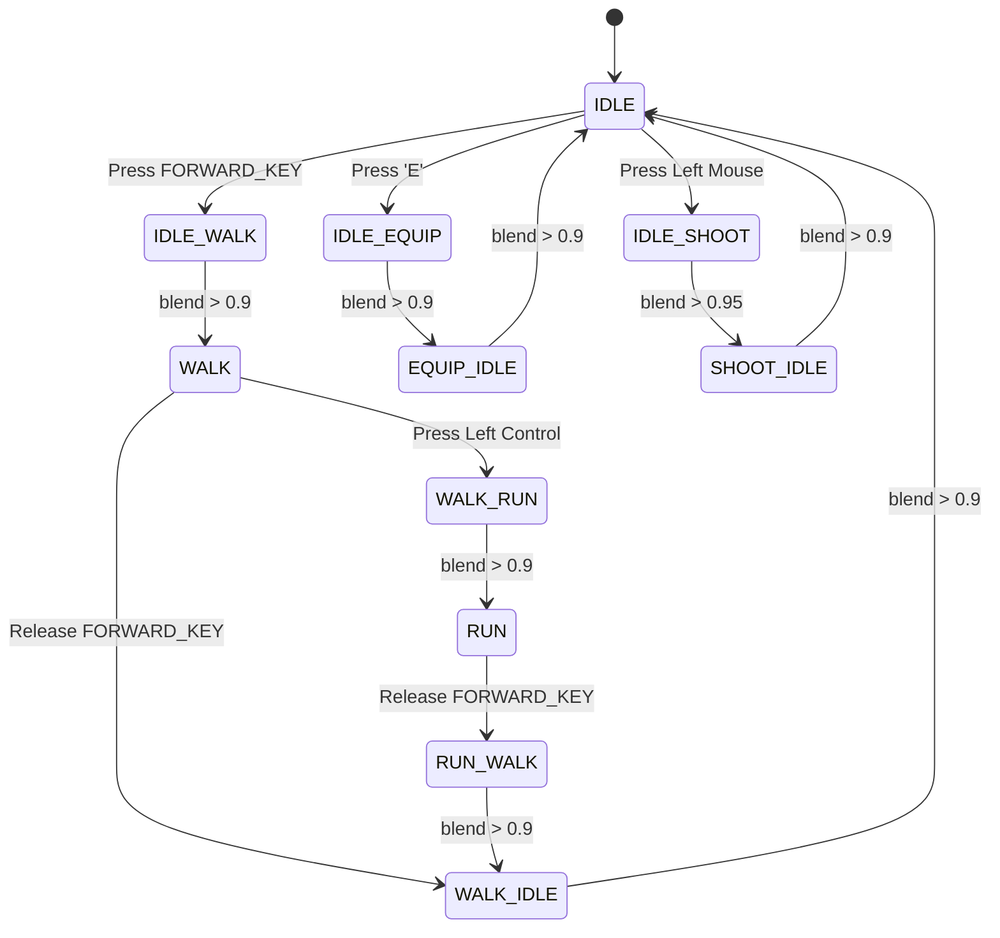

# About
this is demonstration on how to chage animation according to input control with frame interpolation and state management
- press e to equip bow
- press i to walk forward
- press wasd to move camera
- left click to draw the bow
# state machine

# Demo
https://github.com/user-attachments/assets/30a60bc2-8804-4052-b27a-609ccc6557fc
# Credit
all this asset are from https://www.mixamo.com/ with 
- Model: Erika Archer
- Animation: Lite Long Bow Pack
