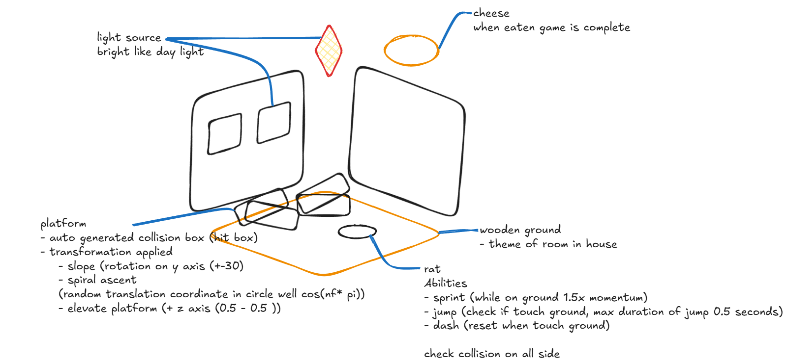

# Design

this game objective is towalk and jup and get to that cheeeeese
# method
- map: loaded model -> rearrange its order -> draw easy box to represent collider box -> load collider model -> AABB collide box generation
- camera + rat model = Player 
# reference
| Asset | Link | License |
| :--- | :--- | :--- |
| Cheese Model | [Low Poly Cheese Wheel](https://sketchfab.com/3d-models/low-poly-cheese-wheel-5072906b43b34d49843b99ec0ead7b38) | Free Standard |
| Original Scene (TheSims4) | [TinyLivingPack](https://sketchfab.com/3d-models/tinylivingpack-e192841259554d1cabb08c7a8180be9f) | CC Attribution |
| Rat Model (Player) | [Cartoon Low Poly Rat Pack](https://sketchfab.com/3d-models/cartoon-low-poly-rat-pack-2c9b95f5b3094a789c4b23fca07d0bc9) | Free Standard |